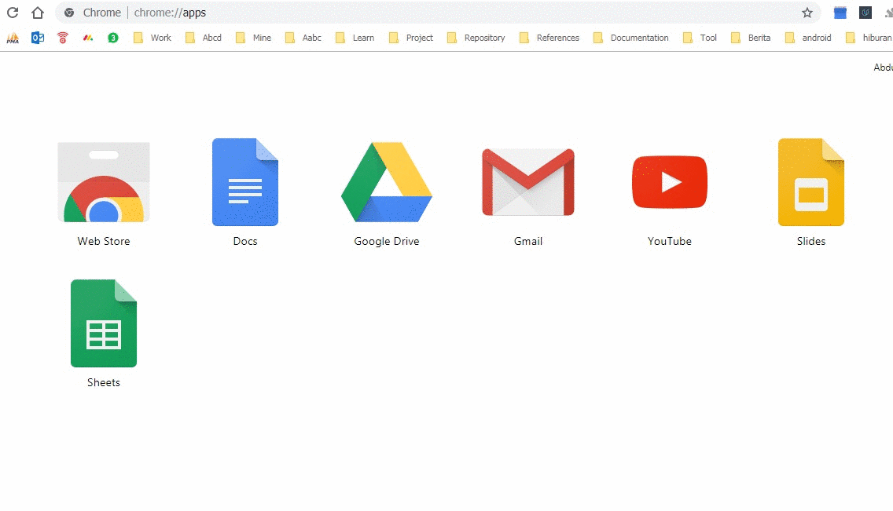
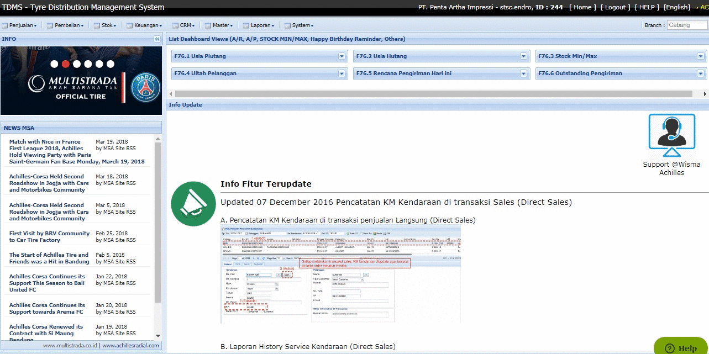
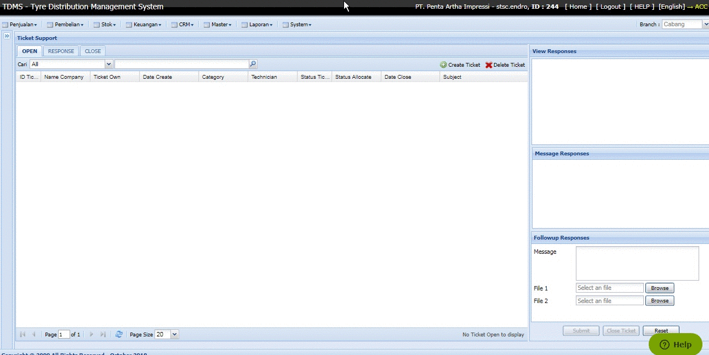

# Ticket System for User

`Jika belum punya akun TDMS, cara daftarnya` [disini](ticket_system_registration.md)

## Buka browser
`Bisa menggunakan Mozilla Firefox, atau Google Chrome.`

## Buka alamat tdms.co
`Masukan tdms.co pada address bar atau klik` [disini](http://tdms.co)`,Kemudian masukan user dan password web security yang telah diberikan pada saat registrasi, jika login web security berhasil anda akan diarahkan ke halaman login seperti pada gambar dibawah ini.`

*Gambar 1: Buka alamat tdms.co kemudian login*

## Pilih menu Ticket
`Pilih System > Ticket Support, Pada halaman ticket, terdapat tiga tab, yaitu OPEN, RESPON, dan CLOSE.`

### OPEN
`Adalah ticket yang sudah dibuat atau dialokasikan, tapi belum dibuat estimasi pengerjaan oleh technician dan direply oleh technician. Pada tab open ini terdapat keterangan allocated dan unallocated, Allocated adalah ketika ticket yang dibuat sudah ditentukan technician penanggung jawabnya oleh admin, Unallocated adalah ketika ticket yang dibuat belum ditentukan technician penanggung jawabnanya.`
### RESPON
`Adalah ticket yang sudah dibuat estimasi pengerjaannya dan direply oleh technician.`
### CLOSE
`Adalah ticket yang sudah diselaesaikan permasalahannya, ticket diclose dengan cara mengklik pada ticket, kemudian klik tombol CLOSE di pojok sebelah kanan bawah halaman ticket.`

*Gambar 2: Pilih menu ticket*

## Buat ticket kepada Team IT
`klik tombol Create Ticket untuk membuat ticket baru, jika ada foto bisa dilampirkan, kemudian klik submit untuk mengirim ticket, setelah di submit team Admin akan mendapatkan email pemberitahuan baru kemuadian admin akan mengalokasikan Ticket tersebut kepada teknisi. jika teknisi sudah merespon dan membuat estimasi pengerjaan, anda akan mendapatkan pemberitahuan via email.`

*Gambar 3: Buat Ticket Baru*
