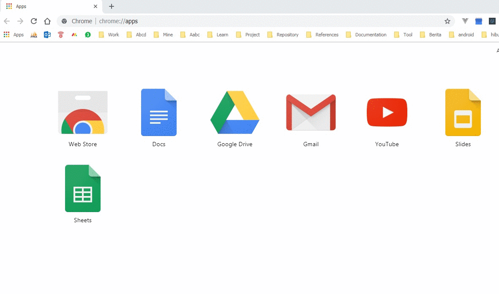

# Ticket System for User

`Jika belum punya akun TDMS, cara daftarnya` [disini](ticket_system_registration.md)

## Buka browser
`Bisa menggunakan Mozilla Firefox, atau Google Chrome.`

## Buka alamat tdms.co
`Masukan tdms.co pada address bar atau klik` [ini](http://tdms.co)

*Gambar 1: Buka alamat tdms.co*

## Login ke tdms.co
`Masukan User dan Password anda`

*Gambar 2: login ke tdms.co*

## Pilih menu Ticket
`Pilih System > Ticket Support`

*Gambar 3: Pilih menu ticket*

## Buat ticket kepada Team IT
`klik tombol Create Ticket untuk membuat ticket baru, jika ada foto bisa dilampirkan, kemudian klik submit untuk mengirim ticket, setelah di submit team Admin akan mendapatkan email pemberitahuan baru kemuadian admin akan mengalokasikan Ticket tersebut kepada teknisi. jika teknisi sudah merespon dan membuat estimasi pengerjaan, anda akan mendapatkan pemberitahuan via email.`

*Gambar 4: Buat Ticket Baru*
